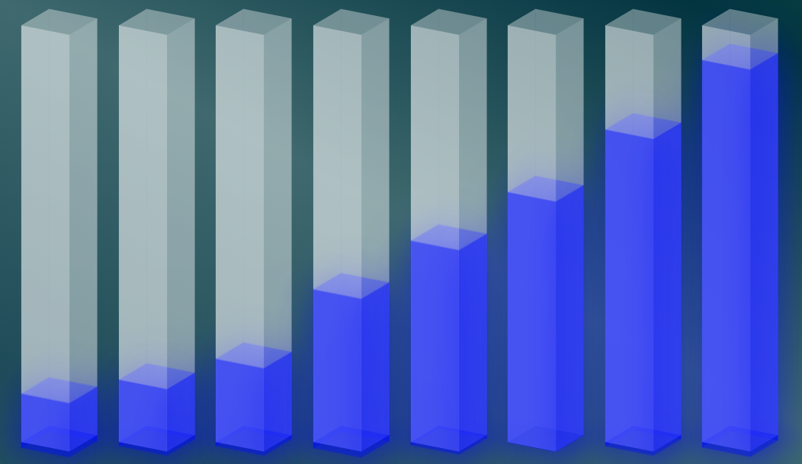

# Sorting Visualizer Algorithm

## Introduction

The Sorting Visualizer is an interactive tool designed to help users understand and observe the behavior of various sorting algorithms through dynamic visual representations.
Built using **React** with **TypeScript** and **vite**, this project showcases the visualization of classic sorting algorithms such as **Bubble Sort**, **Selection Sort**, and **Insertion Sort**. The application is structured into four primary components:

1. **Header**
2. **Buttons**
3. **Array Bars**
4. **Sliders**

## 1. Header

The header serves as the application's title bar, prominently displaying the name "Sorting Visualizer."

## 2. Buttons

The application features a set of buttons that allow users to control the visualization process:

- **Generate New Array**: Creates a new array of bars with random values, offering a fresh dataset for sorting.
- **Bubble Sort**: Initiates the Bubble sorting.
- **Selection Sort**: Initiates the Selection sorting.
- **Insertion Sort**: Initiates the Insertion sorting.

These buttons provide intuitive controls, making it easy for users to interact with the application and explore different sorting methods.

## 3. Array Bars

The central area of the application displays the array bars, which represent the dataset to be sorted. Each bar's height corresponds to its value, allowing users to visually track the sorting process. As the algorithm progresses, the bars move and change colors to indicate comparisons and swaps, providing a clear and engaging depiction of the algorithm's operations.

This is an example:
- Before sorting:

- Sorting process:

- After sorting

## 4. Sliders

Sliders offer users the ability to adjust key parameters of the visualization:

- **Array Size**: Controls the number of bars in the array, allowing users to observe how algorithms handle different dataset sizes, from 2 to 14. This range has been chosen, due to the fact that, to display big and easily distinguishable array bars, there can only be so many.
- **Animation Speed (ms)**: Adjusts the speed of the sorting animation by milliseconds, enabling users to slow down or speed up the visualization process to their preference.

These sliders enhance the application's flexibility, catering to users who wish to delve deeper into the mechanics of sorting algorithms at their own pace.

## Conclusion

The Sorting Visualizer's intuitive design, comprising the header, buttons, array bars, and sliders, provides an effective platform for users to explore and understand sorting algorithms through interactive visualizations.

You can try it here:

Have fun :)